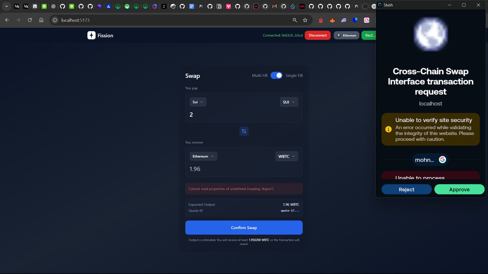

# Fission Cross-Chain Swap Architecture

## Overview

Fission is a decentralized cross-chain atomic swap protocol that facilitates trustless token exchanges between Ethereum and Sui blockchains. The protocol employs a dual-escrow architecture with time-locked smart contracts and cryptographic hash locks to guarantee atomicity and eliminate counterparty risk.

## Core Components

### 1. Smart Contract Infrastructure
- **Ethereum**: Solidity-based Resolver contract integrating with 1inch Limit Order Protocol and Escrow Factory
- **Sui**: Move-based source/destination escrow modules with integrated resolver functionality

### 2. Off-Chain Infrastructure
- **Resolver**: Autonomous service that fulfills cross-chain orders by deploying and managing escrows on both chains
- **Relayer**: Protocol coordination service that broadcasts orders and manages secret distribution among registered resolvers

---

## Cross-Chain Swap Execution Flow

### Phase 1: Order Creation and Distribution

- **Order Specification**: Maker defines swap parameters including source/destination chains, asset types, amounts, and auction configuration
- **Order Signing**: Maker cryptographically signs the order using chain-appropriate signature schemes
- **Order Broadcast**: Relayer distributes the signed order to all subscribed resolvers via WebSocket connections

### Phase 2: Source Escrow Deployment

- **Auction Participation**: Resolvers monitor order broadcasts and compete in a Dutch auction mechanism
- **Winning Bid Execution**: The resolver with the optimal bid deploys the source escrow, depositing both the maker's tokens and a safety deposit
- **Escrow Initialization**: Source escrow is configured with time-locked withdrawal and cancellation mechanisms
- **Event Emission**: Smart contract emits creation events containing parameters required for destination escrow deployment

### Phase 3: Destination Escrow Deployment

- **Event Monitoring**: Winning resolver monitors source chain for escrow creation events
- **Parameter Extraction**: Resolver extracts hashlock, timelocks, and deposit amounts from source escrow events
- **Destination Deployment**: Resolver deploys corresponding escrow on destination chain with matching parameters and appropriate token deposits

### Phase 4: Secret Revelation Authorization

- **Escrow Verification**: Relayer validates that both escrows are properly deployed with correct amounts and parameters
- **Safety Confirmation**: System verifies escrow states and timelock configurations before authorizing secret release
- **Secret Distribution**: Upon verification, user shares the cryptographic secret with the relayer for broadcast to resolvers

### Phase 5: Atomic Settlement Execution

- **Cross-Chain Withdrawal**: Resolver utilizes the revealed secret to simultaneously withdraw tokens from both escrows
- **Destination Settlement**: Tokens are transferred to the taker on the destination chain
- **Source Settlement**: Tokens are transferred to the maker on the source chain, completing the atomic swap

---

## Chain-Specific Implementation Differences

### Ethereum vs Sui Transaction Models

**Ethereum Intent-Based Architecture**:
- Supports off-chain order signing with on-chain execution via 1inch Limit Order Protocol
- Makers sign permits allowing resolvers to programmatically access funds during escrow creation
- EIP-712 structured data signing enables complex order parameters without gas consumption

**Sui Object-Oriented Architecture**:
- Token assets exist as distinct objects requiring explicit on-chain transfers
- Makers must pre-fund order objects on-chain, transferring assets before resolver fulfillment
- Move's ownership model necessitates explicit object transfers rather than approval-based patterns

### Source Escrow Creation Patterns

**Ethereum → Sui Swaps**:
- Resolver calls `fillOrderArgs` on 1inch Limit Order Protocol with maker's signed permit
- Atomic execution transfers maker's tokens and safety deposit to newly created escrow
- Leverages Ethereum's account-based model for efficient batch operations

**Sui → Ethereum Swaps**:
- Maker deploys on-chain order object containing escrowed tokens
- Resolver creates source escrow by referencing the pre-funded order object
- Utilizes Sui's object-centric design for explicit asset ownership transfers

---
